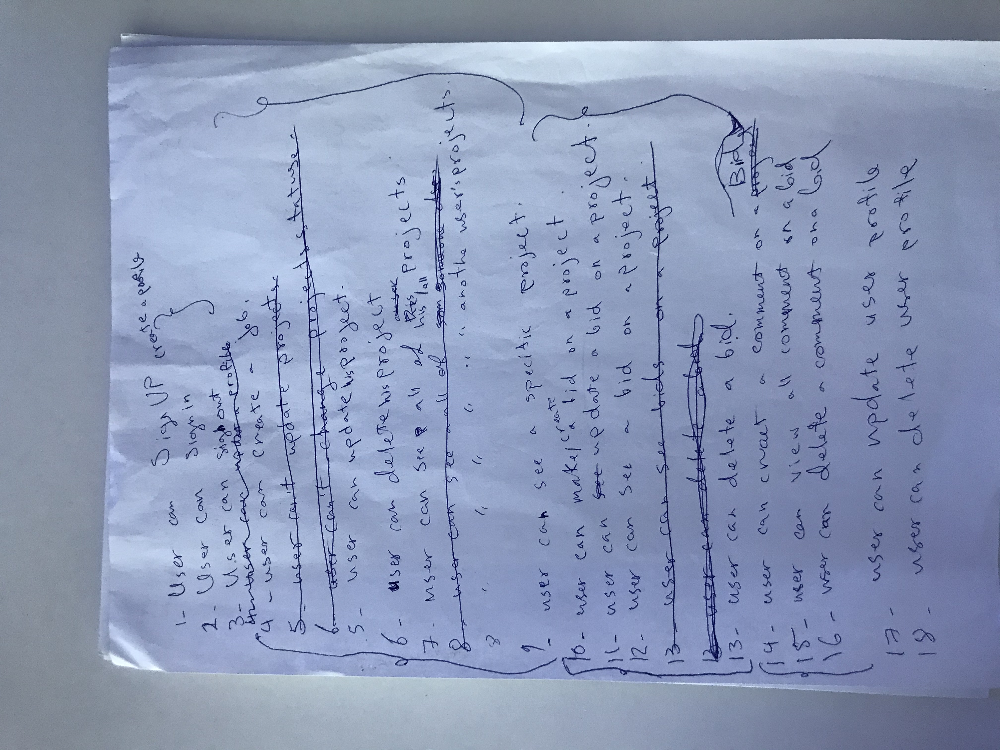
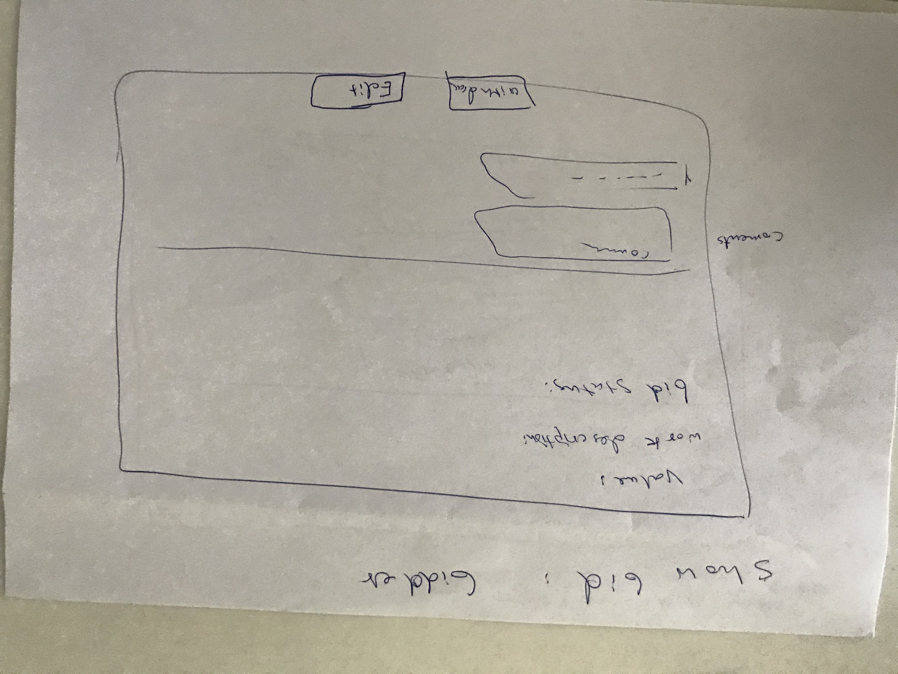
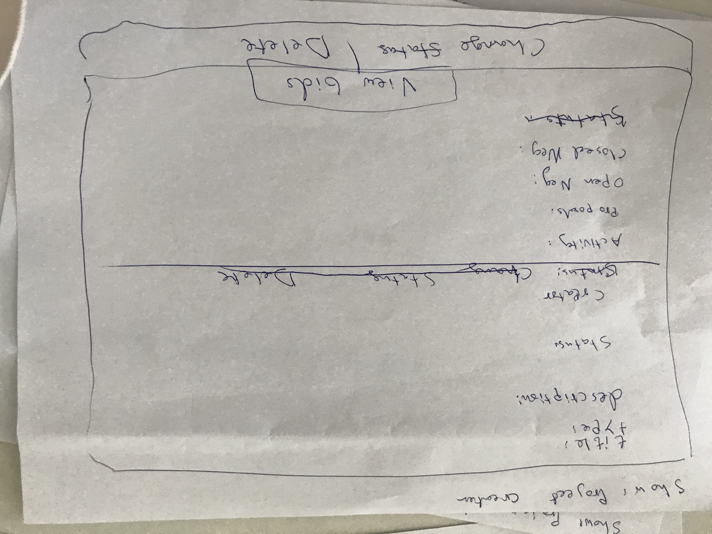
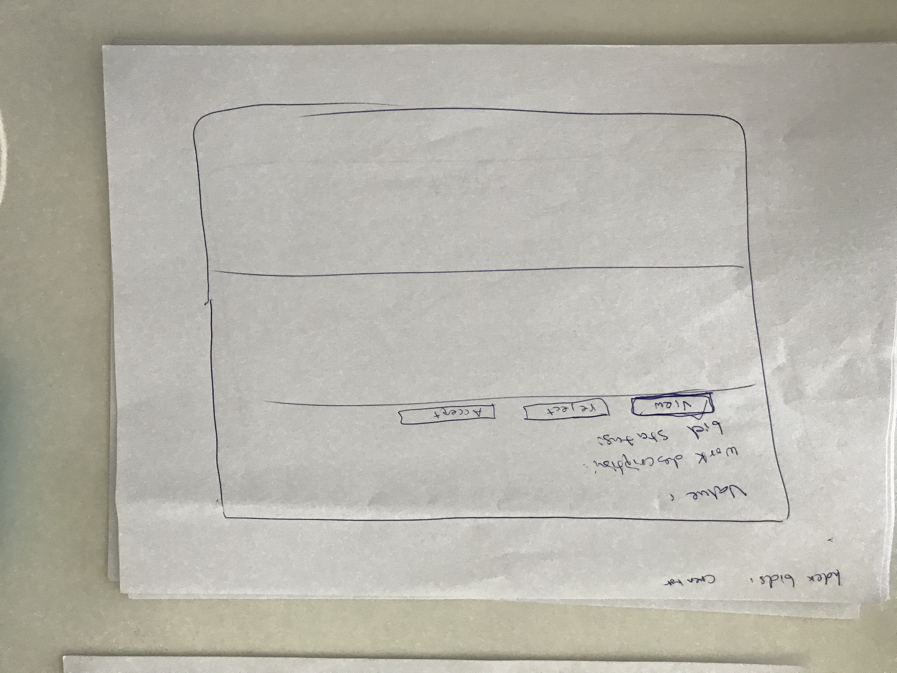
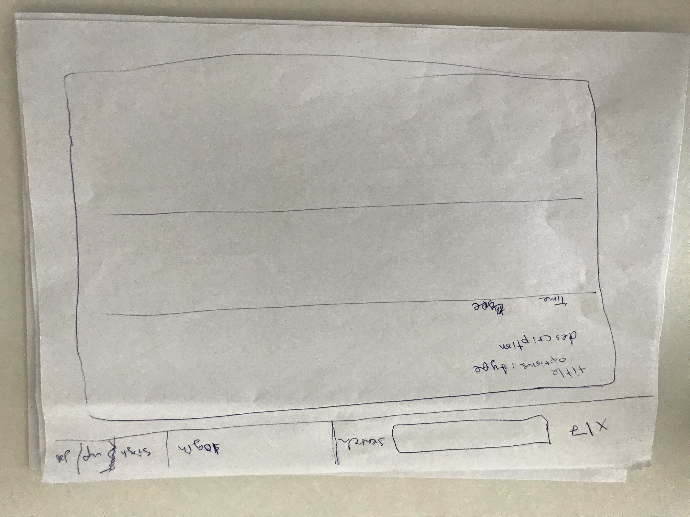
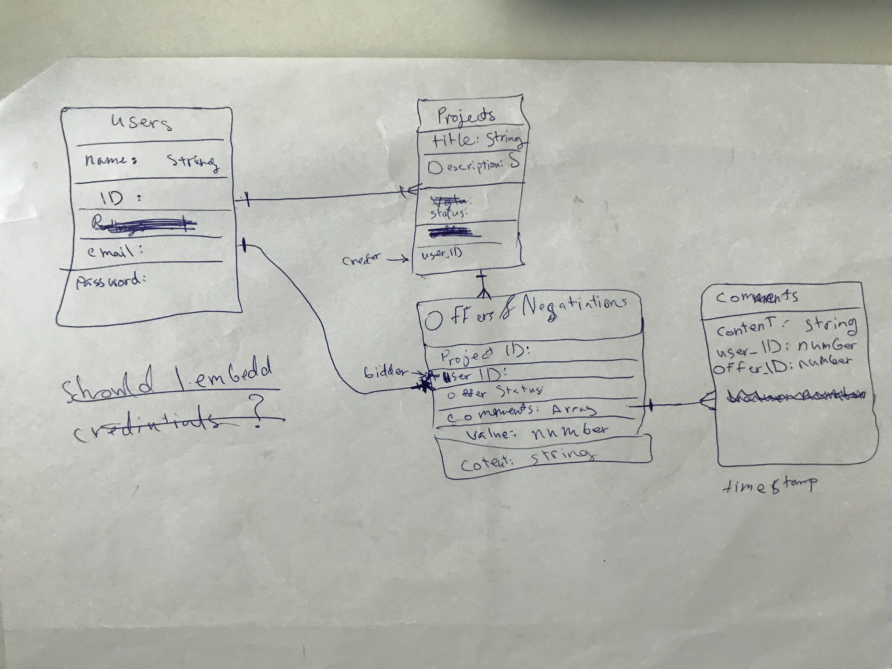

# [The Hive (APP)]( https://almarrim.github.io/thehive-app/):
The Hive is a business app, where work can be offerd such as construction, material supply  etc. People give proposals on jobs and job creator can select as desire.  Users can both create and bid on jobs available.[To The App](https://almarrim.github.io/thehive-app/), [To The Backend Repo](https://github.com/almarrim/thehive-backend-app)

## Technologies Used:
- HTML
- CSS
- JavaScript
- [Reactjs](https://reactjs.org)
- [Bootstrap](https://getbootstrap.com)
- [npm](https://www.npmjs.com)
- [axios](https://www.npmjs.com/package/axios)
- [router-dom](https://reacttraining.com/react-router/web/guides/quick-start)
- Express.js
- MongoDB/Mongoose
- Text Editer
- Web browser
## Planning:
1. User Stories:

2. Wireframes:
    - 
    - 
    - 
    - 
3. DB Relations

## How it works:
- create a job
- receive proposals
- make proposals
## Author:
Mohammed Almarri

